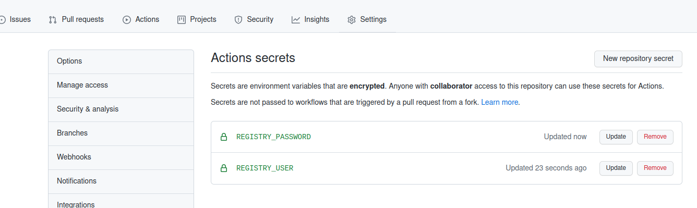
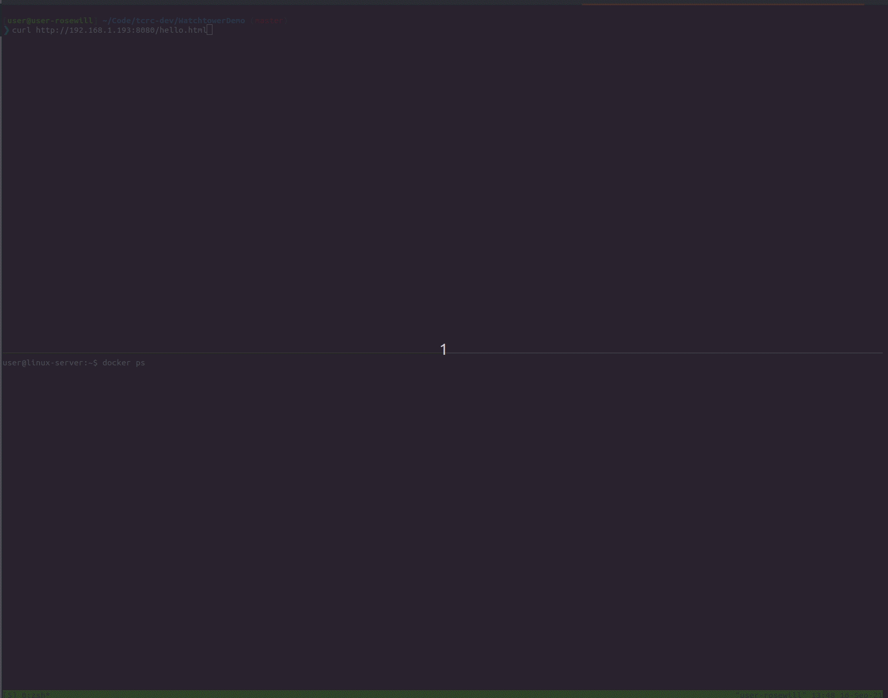

# Watchtower Example
This repository is a small example showing how Watchtower and GitHub Actions can be used to update a running container, including instructions on how to setup an Ubuntu Server for this workflow.

The values in the setup steps and in this repository are based on an Azure Container Registry called `julianzp.azurecr.io`.

# Ubuntu Server
The following steps assume a fresh Ubuntu 20.04 server with Internet access.
1. Update server: `sudo apt update && sudo apt upgrade -y`
2. Get Docker setup script `curl -fsSL https://get.docker.com -o get-docker.sh`
3. Run Docker setup script `sudo sh get-docker.sh`
4. Add Docker group: `sudo groupadd docker`
5. Add current user to Docker group `sudo usermod -aG docker $USER`
7. If using an Azure Container Registry, install the Azure cli: `curl -sL https://aka.ms/InstallAzureCLIDeb | sudo bash`
8. Login to the Azure cli: `az login`
9. Get an Azure Container Registry token: `az acr login --name julianzp.azurecr.io --expose-token`
10. Have Docker login to the Azure Container Registry: `docker login julianzp.azurecr.io --username 00000000-0000-0000-0000-000000000000 --password $TOKEN`
11. Start your container: `docker run -d --name=hello -p 8080:80 julianzp.azurecr.io/julianzp/hello:latest`
12. Start watchtower: 
```
docker run -d \
  --name watchtower \
  -v /var/run/docker.sock:/var/run/docker.sock \
  -v /home/user/.docker/config.json:/config.json \
  containrrr/watchtower hello --debug -i 30
```
The arguments here specify:
- check for updates every 30 seconds 
- only monitoring the "hello" container (that was started in Step 11)
Also note this path `/home/user/.docker/config.json` will need to match what it is on your actual server.

  # GitHub Action
  1. Add REGISTRY_USER and REGISTRY_PASSWORD secrets (these are the values for a user that can push images to the registry):
  
  
  2. The action itself builds the Dockerfile in the repository and pushes it to the Azure Container Registry. Have a look [here](.github/workflows/main.yaml).


  # Demo Gif
  